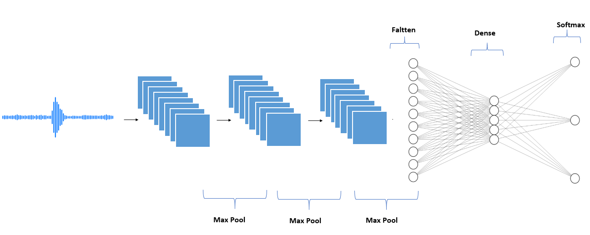
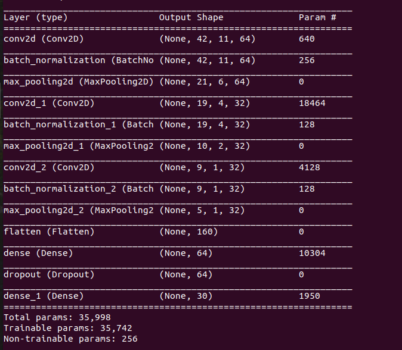

# Voice Recognition

This is a full-stack project for voice recognition system.

Different types of technologies such as `DeepLearning` and `WebServers` are used here.

To have a good performance on different operating systems `docker` is used here.

# Dataset

The dataset for simple words which is called speech commands dataset 
can be downloaded from <a href="https://ai.googleblog.com/2017/08/launching-speech-commands-dataset.html">here</a>.

# File By File Descriptions

## Prepare dataset

As for the neural network we need numerical data, so a conversion from audio files to something numerical is needed.
This is done in `prepare_dataset.py` file. This file makes a `json` file called `data.json` that has some informations about dataset 
like numberical data which is calculated by `librosa` or their label or all the categories.

## Model

In this file we have builing and training the model which is a convolutional neural netowork.

It first loads the data from the json file we mentioned earlier, then we split data to train, test, and validation sets using `sklearn`.

### Network

Here is the shape of neural network:



And here is datails:



## Word Split Service

In this file there is an singleton class which means just one instance of that class can exist.

Here we give a file path then preprocess it, like what we did for train data and then we make prediction of that.

Tets wav files should be in `tests` folder. To run this file in terminal you should run below command:

```
python3 python3 word_spot_service.py test_file_path
```

which test_file_path in it is the location of test_file_path that is a `txt` file in below format:

```
word1,word1_file_name
word2,word2_file_name
.
.
.
word_n,word_n_file_name
```

## Server

This file is based on Flask and invloves the API system.

There is an just `POST` api called `predict` which gets an audio file and then return prediction response in json format.

It receives the file from `files` in `request`.

## Client

To run this file you need to run the following command:
```
python3 client.py file_name
```

The file name is the name of file you want to send to api for prediction. The file should exist in `tests` folder.

# uWSGI

`uWSGI` is a server application which speaks the `WSGI` specification.

`WSGI` is a the abbriviation of `Web Server Gateway Interface` which is a server/app communication specification.

`uwsgi` is `uWSGI` wire protocol.

`app.ini` file is for `uwgi` run settings.

To use it run command below:
```
uwsgi app.ini
```

Remember to install `uwsgi` by runnung command below:
```
pip install uwsgi
```

# NGinx
NginX, is a web server that can also be used as a reverse proxy, load balancer, mail proxy and HTTP cache. 

Nginx can be deployed to serve dynamic HTTP content on the network using FastCGI, SCGI handlers for scripts, WSGI application servers or Phusion Passenger modules, and it can serve as a software load balancer.

Here we have `nginx.conf` in `nginx` directory for using this web server.

# Docker
Docker is a set of platform as a service (PaaS) products that use OS-level virtualization to deliver software in packages called containers.

Using docker containers we can make our progeam protable.

Docker commands are in `Dockerfile`s in `nginx` and `flask` directories. Also creating is done by `docker-compose.yml` pipleline.

To build docker files use below command:
```
docker-compose build
```

And to run it use:
```
docker-compose up
```

Remeber you need to install docker which can be done by below command:
```
sudo snapp install docker
```

*Made By Amirhossein Abaskohi*